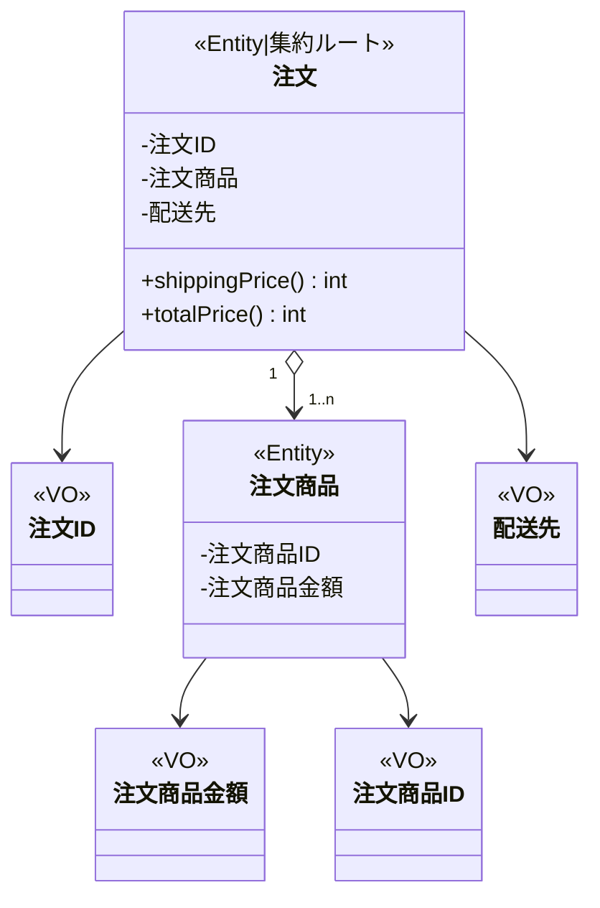

# ddd-yodobashi

## 対象
https://www.yodobashi.com/ec/support/beginner/delivery/index.html

## 関係する単語
- VO(Value Object)：値オブジェクト
- Entity：エンティティ

## モデリング

|日本語名|英語名|種類|制約|
-|-|-|-
|注文ID|OrderId|VO|ULID|
|注文|Order|Entity \| 集約ルート||
|注文商品|OrderItem|Entity||
|注文商品ID|OrderItemId|VO|ULID|
|注文商品金額|Price|VO||
|配送先|Shipping|VO||

